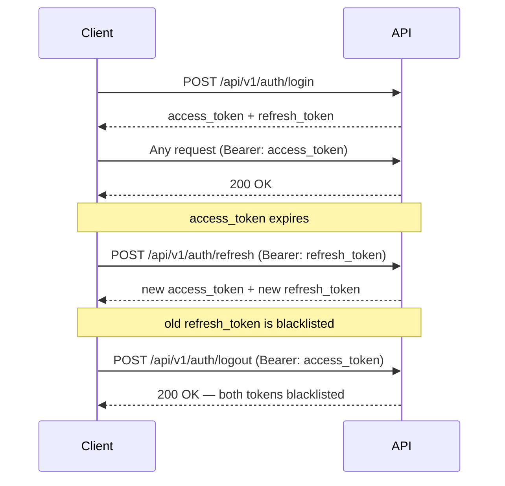
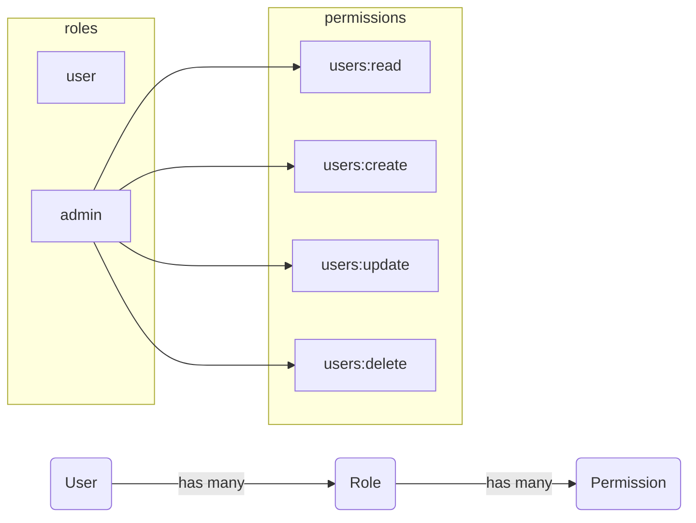
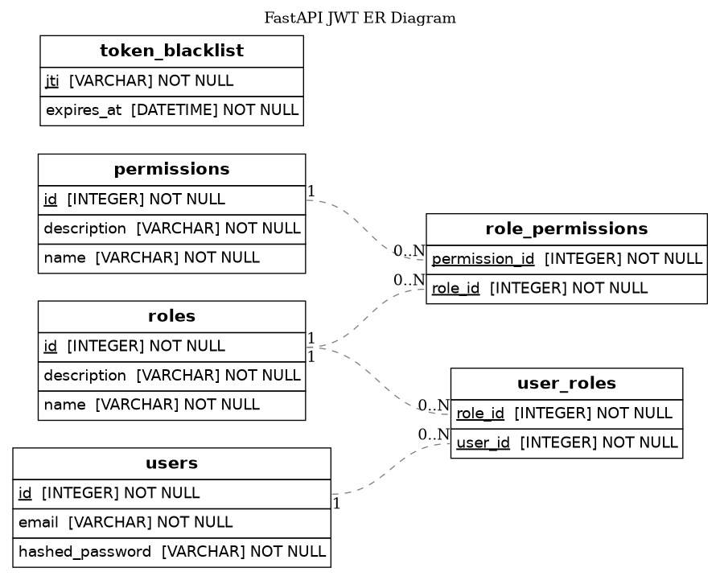

# fastapi-sentinel

> Production-ready FastAPI template with async SQLAlchemy, JWT authentication (RS256), role-based access control, and a clean layered architecture.

[](https://www.python.org)
[](https://fastapi.tiangolo.com)
[](https://docs.sqlalchemy.org)
[](https://www.postgresql.org)
[](https://docs.astral.sh/ruff)
[](https://mypy-lang.org)
[](https://jwt.io)

---

## Navigation

- [Features](#features)
- [Stack](#stack)
- [Getting started](#getting-started)
- [API](#api)
- [Auth flow](#auth-flow)
- [RBAC model](#rbac-model)
- [Development](#development)
- [ER diagram](#er-diagram)

---

## Features

- **JWT auth** — asymmetric RS256 keys; access token (15 min) + refresh token (30 days) with per-token blacklist and rotation on refresh
- **RBAC** — roles and permissions defined as `StrEnum`s, seeded via Alembic data migrations; `require_role` / `require_any_role` / `require_permission` / `require_any_permission` FastAPI dependencies
- **Unit of Work** — single `UnitOfWork` wraps all repositories behind one `async with` session
- **Generic repository** — `BaseRepository[Model, InsertDTO, UpdateDTO]` with `get_by_id`, `get_all`, `insert`, `update`, `delete`
- **ER diagram** — auto-generated via eralchemy; regenerate with `just er`

## Stack

| Layer | Library |
|---|---|
| Web | [FastAPI](https://fastapi.tiangolo.com) |
| ORM | [SQLAlchemy 2](https://docs.sqlalchemy.org) (async) |
| Database | [PostgreSQL 18](https://www.postgresql.org) via [asyncpg](https://magicstack.github.io/asyncpg) |
| Migrations | [Alembic](https://alembic.sqlalchemy.org) |
| IoC / DI | [Dishka](https://dishka.readthedocs.io) |
| Auth | [PyJWT](https://pyjwt.readthedocs.io) (RS256), [pwdlib](https://github.com/frankie567/pwdlib) (Argon2) |
| Validation | [Pydantic v2](https://docs.pydantic.dev) |
| Config | [pydantic-settings](https://docs.pydantic.dev/latest/concepts/pydantic_settings) |

---

## Getting started

### 1. Generate RS256 key pair

```bash
openssl genrsa -out private.pem 2048
openssl rsa -in private.pem -pubout -out public.pem
```

### 2. Create `.env`

```dotenv
MY_APP__DB__USERNAME=postgres
MY_APP__DB__PASSWORD=postgres
MY_APP__DB__NAME=sentinel
MY_APP__DB__HOST=localhost
MY_APP__DB__PORT=5432

MY_APP__APP__JWT__PRIVATE_KEY="$(cat private.pem)"
MY_APP__APP__JWT__PUBLIC_KEY="$(cat public.pem)"
```

### 3. Run with Docker Compose

```bash
just dc up -d --build
```

This starts three services in order: `db` → `migrate` (runs Alembic `upgrade head`) → `app`.

### 4. Bootstrap first admin

The migration seeds roles and permissions but no users. Register the first user via the public API:

```bash
curl -X POST http://localhost:8000/api/v1/users \
  -H "Content-Type: application/json" \
  -d '{"email": "admin@example.com", "password": "yourpassword"}'
```

Then assign the admin role directly in the database (via `just psql` or any Postgres client):

```sql
INSERT INTO user_roles (user_id, role_id)
SELECT u.id, r.id FROM users u, roles r
WHERE u.email = 'admin@example.com' AND r.name = 'admin';
```

> [!NOTE]
> This one-time SQL step is only needed for the very first admin. After that, role assignment is done through the API using an admin token — `POST /v1/users/{id}/roles/{role_id}`.

### 5. Local development (without Docker)

```bash
uv sync
just dc up -d db          # only the database
just alembic upgrade head
just run
```

API is available at `http://localhost:8000`. Interactive docs at [`/docs`](http://localhost:8000/docs).

---

## API

### Auth

| Method | Path | Auth | Description |
|---|---|---|---|
| `POST` | `/api/v1/auth/login` | — | Returns access + refresh tokens |
| `POST` | `/api/v1/auth/refresh` | Bearer (refresh token) | Blacklists old refresh token, issues new pair |
| `POST` | `/api/v1/auth/logout` | Bearer (access token) + `refresh_token` in body | Blacklists both tokens |


### Users — self-service

| Method | Path | Auth | Description |
|---|---|---|---|
| `POST` | `/api/v1/users` | — | Register |
| `GET` | `/api/v1/users/me` | any token | Get own profile |
| `PUT` | `/api/v1/users/me` | any token | Replace own profile |
| `PATCH` | `/api/v1/users/me` | any token | Update own profile |
| `DELETE` | `/api/v1/users/me` | any token | Delete own account, returns deleted profile |
| `POST` | `/api/v1/users/me/password` | any token | Change own password (requires current password) |

### Users — management

| Method | Path | Required | Description |
|---|---|---|---|
| `GET` | `/api/v1/users` | `users:read` | List all users |
| `GET` | `/api/v1/users/{id}` | `users:read` | Get user |
| `PUT` | `/api/v1/users/{id}` | `users:update` | Replace user |
| `PATCH` | `/api/v1/users/{id}` | `users:update` | Update user |
| `DELETE` | `/api/v1/users/{id}` | `users:delete` | Delete user |
| `POST` | `/api/v1/users/{id}/password` | `users:update` | Reset user password (no current password required) |
| `POST` | `/api/v1/users/{id}/roles/{role_id}` | role `admin` | Assign role |
| `DELETE` | `/api/v1/users/{id}/roles/{role_id}` | role `admin` | Revoke role |

### RBAC (read-only)

| Method | Path | Required | Description |
|---|---|---|---|
| `GET` | `/api/v1/roles` | role `admin` | List roles |
| `GET` | `/api/v1/permissions` | role `admin` | List permissions |

---

## Auth flow



---

## RBAC model



Regular users have no permissions — authentication alone grants access to `/users/me/*` endpoints. Permissions are for staff roles that manage other users.

> [!IMPORTANT]
> Roles and permissions are defined as `StrEnum`s (`RoleEnum`, `PermissionEnum`) and seeded via Alembic data migrations. To add a new role or permission, extend the enum and write a migration — do not insert them manually.

---

## Development

```bash
just run          # start dev server with hot reload
just lint         # ruff check + format check
just fmt          # ruff autofix + format
just typecheck    # mypy strict
just test         # pytest
just er           # regenerate docs/er_diagram.png
just alembic revision --autogenerate -m "description"
just alembic upgrade head
```

Pre-commit hooks run ruff on every commit. Install once with:

```bash
uv run pre-commit install
```

<details>
<summary>Project structure</summary>

```
src/
├── api/v1/          # routers: auth, users, roles, permissions
├── services/        # business logic
├── repo/            # repository layer
├── models/          # SQLAlchemy ORM models
├── schemas/         # Pydantic request/response schemas
├── dto/             # internal data transfer objects
├── enums/           # RoleEnum, PermissionEnum, TokenType
├── exceptions/      # domain exceptions
├── ioc/             # Dishka providers (container wiring)
├── core/            # UnitOfWork
└── config.py        # pydantic-settings
```

</details>

<details>
<summary>Configuration reference</summary>

All settings use the `MY_APP__` prefix with `__` as the nested delimiter.

| Variable | Default | Description |
|---|---|---|
| `MY_APP__DB__USERNAME` | — | Postgres user |
| `MY_APP__DB__PASSWORD` | — | Postgres password |
| `MY_APP__DB__NAME` | — | Database name |
| `MY_APP__DB__HOST` | `localhost` | Postgres host |
| `MY_APP__DB__PORT` | `5432` | Postgres port |
| `MY_APP__APP__JWT__PRIVATE_KEY` | — | RS256 private key (PEM) |
| `MY_APP__APP__JWT__PUBLIC_KEY` | — | RS256 public key (PEM) |
| `MY_APP__APP__JWT__ACCESS_TTL` | `900` (15 min) | Access token lifetime in seconds |
| `MY_APP__APP__JWT__REFRESH_TTL` | `2592000` (30 days) | Refresh token lifetime in seconds |

</details>

---

## ER diagram


